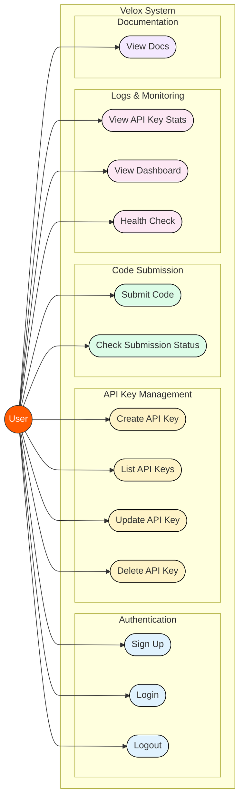
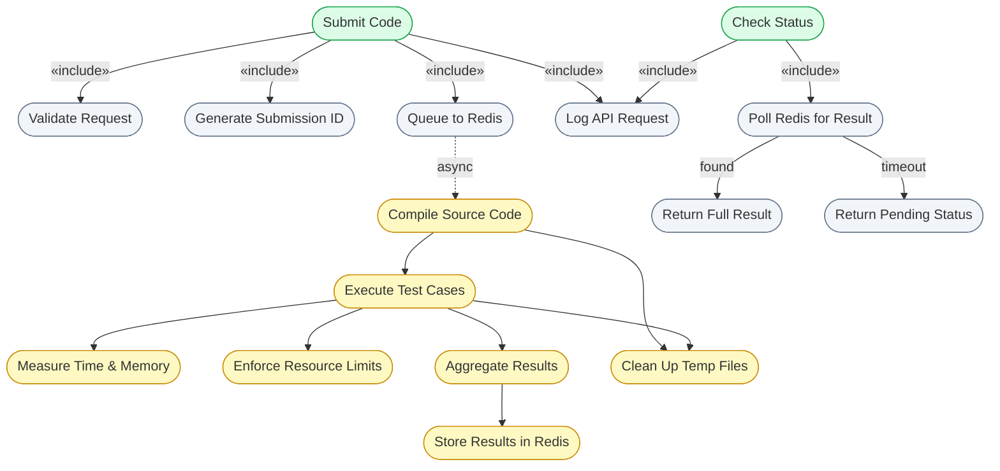
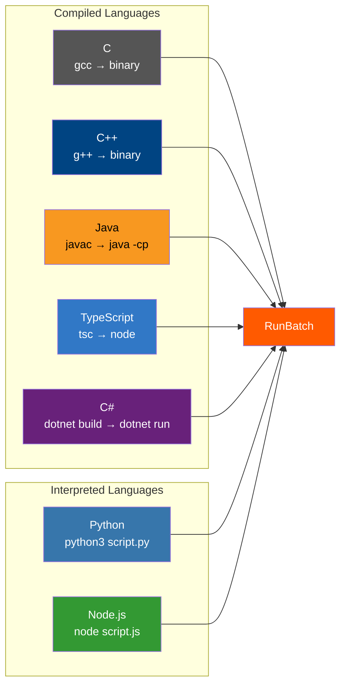

# 4. Use Case Diagram

This document identifies the primary **actor** in the Velox system and all **operations** they can perform.

---

## 4.1 System Use Case Diagram

---

## 4.2 Internal System Flow (Include / Extend)

When the User triggers **Submit Code** or **Check Status**, the system internally performs the following operations:

---

## 4.3 Detailed Use Case Descriptions

### UC1: Sign Up
| Field | Value |
|-------|-------|
| **Actor** | User |
| **Trigger** | `POST /auth/signup` with JSON body |
| **Preconditions** | None |
| **Flow** | 1. User sends `name`, `email`, `password`   2. Server validates input (email format, password ≥ 8 chars)   3. Hash password and store in PostgreSQL   4. Return `201 Created` with user details |
| **Error Cases** | Missing name → 400, Email taken → 400, Invalid email → 400, Password too short → 400 |

### UC2: Login
| Field | Value |
|-------|-------|
| **Actor** | User |
| **Trigger** | `POST /auth/login` with JSON body |
| **Flow** | 1. User sends `email` and `password`   2. Server verifies credentials   3. Generate JWT token   4. Return `200 OK` with token |
| **Error Cases** | Invalid credentials → 401 |

### UC3: Logout
| Field | Value |
|-------|-------|
| **Actor** | User |
| **Trigger** | `POST /auth/logout` |
| **Flow** | 1. Stateless JWT — server responds with success   2. Client discards token locally |

### UC4: Create API Key
| Field | Value |
|-------|-------|
| **Actor** | User |
| **Trigger** | `POST /auth/api-keys` (requires session auth) |
| **Flow** | 1. User provides `name`, optional `scopes` and `expires_at`   2. Default scopes: `["submit", "status"]`   3. Server generates key, stores hash in DB   4. Returns full key (shown only once), ID, and display hint |
| **Error Cases** | Missing name → 400, Unauthorized → 401 |

### UC5: List API Keys
| Field | Value |
|-------|-------|
| **Actor** | User |
| **Trigger** | `GET /auth/api-keys` (requires session auth) |
| **Flow** | Returns all API keys belonging to the authenticated user |

### UC6: Update API Key
| Field | Value |
|-------|-------|
| **Actor** | User |
| **Trigger** | `PATCH /auth/api-keys?id=<uuid>` (requires session auth) |
| **Flow** | Renames an existing API key |

### UC7: Delete API Key
| Field | Value |
|-------|-------|
| **Actor** | User |
| **Trigger** | `DELETE /auth/api-keys?id=<uuid>` (requires session auth) |
| **Flow** | Permanently revokes and deletes an API key |

### UC8: Submit Code
| Field | Value |
|-------|-------|
| **Actor** | User |
| **Trigger** | `POST /submit` with JSON body (requires API key auth) |
| **Preconditions** | Request body contains `language`, `source_code`, and at least one `test_case` |
| **Flow** | 1. API validates `TimeLimitMs ≤ 5000` and `MemoryLimitKb ≤ 512000`   2. Generate UUID via `uuid.New()`   3. Serialize request to JSON   4. `LPUSH` to Redis `"submissions"` queue   5. Log API request   6. Return `202 Accepted` with `submission_id` |
| **Postconditions** | Submission is queued for processing |
| **Error Cases** | Invalid JSON → 400, Limits too high → 400, Redis push failure → 500 |

### UC9: Check Submission Status
| Field | Value |
|-------|-------|
| **Actor** | User |
| **Trigger** | `GET /status?submission_id=<id>` (requires API key auth) |
| **Flow** | 1. Extract `submission_id` from query params   2. `BRPOP "results:<id>"` with 1s timeout   3a. If found → return the full response JSON and update log   3b. If timeout → return `{"status": "pending"}` |
| **Error Cases** | Missing `submission_id` → 400 |

### UC10: View API Key Stats
| Field | Value |
|-------|-------|
| **Actor** | User |
| **Trigger** | `GET /auth/api-keys/stats?id=<uuid>` (requires session auth) |
| **Flow** | Returns usage metrics (Total requests, RPM, RPD, Success Rate) for a specific API key |

### UC11: View Dashboard
| Field | Value |
|-------|-------|
| **Actor** | User |
| **Trigger** | `GET /dashboard` (requires session auth) |
| **Flow** | Returns user-specific profile and activity data |

### UC12: Health Check
| Field | Value |
|-------|-------|
| **Actor** | User |
| **Trigger** | `GET /health` |
| **Flow** | Returns `{"status": "healthy"}` if API server is running |

### UC13: View Swagger Docs
| Field | Value |
|-------|-------|
| **Actor** | User |
| **Trigger** | `GET /swagger/` (development mode only) |
| **Flow** | Serves the interactive Swagger UI for API exploration |

---

## 4.4 Supported Languages Matrix

The system supports 7 programming languages. Each language follows a specific execution pipeline:

